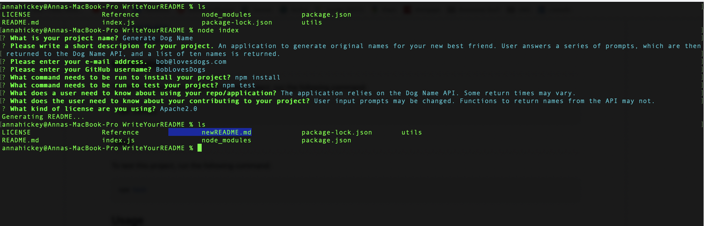

# Write Your README


  ## Description

  A command-line application that allows the user to follow a series of prompts to generate a desrciptive, effective README.md file. File will be saved under newREADME so as not to conflict with existing README files.

  ## Table of Contents

  * [Reference](#reference)
  * [Installation](#installation)
  * [Test](#test)
  * [Usage](#usage)
  * [License](#license)
  * [Contributing](#contributing)
  * [Questions](#questions)
  
  ## Reference
  Sample of a generated README
 

  Screenshot of a completed use.
  

  ## Installation

  To install all necessary materials for this project, run the following command:

  ```bash
  npm install
```

  ## Test

  To test this project, run the following command:

  ```bash
  npm test
```

  ## Usage

  This application uses the inquirer package to create a series of prompts. Generated files will be saved to newREADME.md and will write over previous files with that name. Be sure to rename and save files before you generate new README files.

  ## License

  This application is protected under the MIT license.

  For more information, visit this link: [MIT Info](https://opensource.org/licenses/MIT)

  ## Contributing
  Prompts from inquirer and design on markdown can be updated and modified to fit all the needs of your specific project.

  ## Questions

  If you have any questions, please reach out.
  * GitHub: [AHFotis](https://github.com/AHFotis)
  * Email: annahickey2@gmail.com


